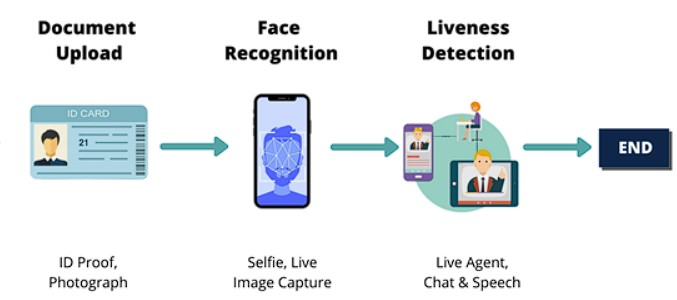

# eKYC 
> Note: I have recently updated the code to be more compatible with vggface2 (though I haven't tested it yet). If you encounter any issues, please feel free to open an issue in the repository. I apologize for any inconvenience this may cause.

----------------------------

eKYC (Electronic Know Your Customer) is a project designed to electronically verify the identity of customers. This is an essential system to ensure authenticity and security in online transactions.


eKYC (Electronic Know Your Customer) is an electronic customer identification and verification solution that enables banks to identify customers 100% online, relying on biometric information and artificial intelligence (AI) for customer recognition, without the need for face-to-face interactions as in the current process.

## eKYC flow 
This README provides an overview of the eKYC (Electronic Know Your Customer) flow, which comprises three main components: Upload Document (ID Card), Face Recognition (Verification), and Liveness Detection.



#### 1. Upload Document (ID Card)

Initially, users are required to upload an image of their ID card. This step is essential for extracting facial information from the ID card photo.

#### 2. Face Verification

Following the document upload, we proceed to verify whether the user matches the individual pictured on the ID card. Here's how we do it:

- **Step 1 - Still Face Capture**: Users are prompted to maintain a steady face in front of the camera.

- **Step 2 - Face Matching (Face Verification)**: Our system utilizes advanced facial recognition technology to compare the live image of the user's face with the photo on the ID card.

#### 3. Liveness Detection

To ensure the user's physical presence during the eKYC process and to prevent the use of static images or videos, we implement Liveness Detection. This step involves the following challenges to validate the user's authenticity:

- **Step 3 - Liveness Challenges**: Users are required to perform specific actions or challenges, which may include blinking, smiling, or turning their head.

- **Step 4 - Successful Liveness Verification**: Successful completion of the liveness challenges indicates the user's authenticity, confirming a successful eKYC process.

These combined steps—ID card upload, Face Verification, and Liveness Detection—comprehensively verify the user's identity, enhancing security and reducing the risk of fraudulent attempts.

## Installation
1. Clone the repository
```bash
git clone https://github.com/manhcuong02/eKYC
cd eKYC
```
2. Install the required dependencies
```bash
pip install -r requirements.txt
```

## Usage
1. Download weights of the [pretrained VGGFace models](https://drive.google.com/drive/folders/1-pEMok04-UqpeCi_yscUcIA6ytvxhvkG?usp=drive_link) from ggdrive, and then add them to the 'verification_models/weights' directory. Download weights and landmarks of the [pretrained liveness detection models](https://drive.google.com/drive/folders/1S6zLU8_Cgode7B7mfJWs9oforfAODaGB?usp=drive_link) from ggdrive, and then add them to the 'liveness_detection/landmarks' directory

2. Using the PyQt5 Interface:
```bash
python3 main.py
```

## Results
Due to concerns about my personal information, I kindly request that the video results be deleted
